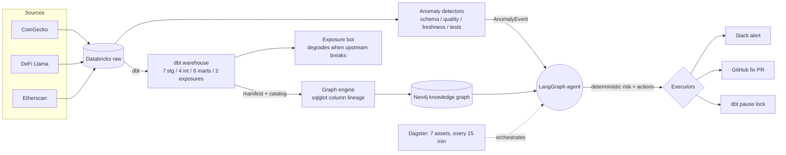
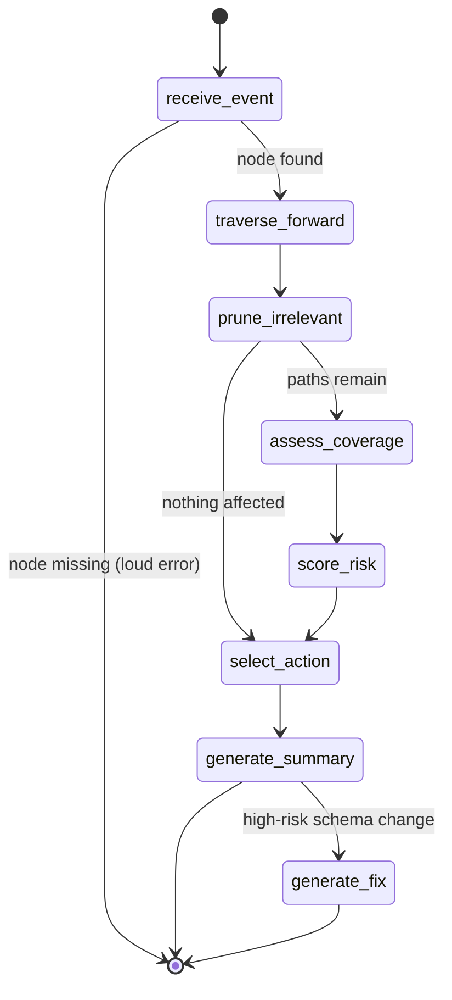
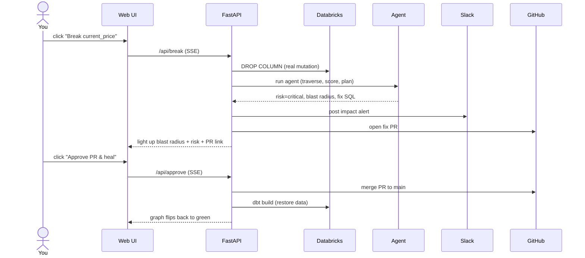

<div align="center">

# 🛰️ Autonomous Impact Analyst

**An agent that watches a crypto/DeFi data warehouse, traces the blast radius of any change through a column-level lineage graph, and autonomously alerts Slack + opens a fix PR — then heals itself when you approve.**

[](https://github.com/kartikeyamandhar/autonomous-impact-analyst/actions)


</div>

> **Break a column → the lineage blast radius lights up, a Slack alert fires, and a GitHub PR opens. Approve the PR → the fix merges and the graph heals.** All the *reasoning* (impact, risk, actions) is deterministic graph work; an LLM is used only to phrase the alert and draft the SQL fix (which is validated before it can become a PR).

<div align="center">

### ▶️ Live demo


<sub>Record `make web` (break → Slack → PR → approve → heal) and drop the clip at <code>docs/demo.gif</code>.</sub>

</div>

---

## What it is

Modern data stacks fail *silently*: an upstream API renames a field, and three dashboards quietly go wrong days later. This project is an **autonomous impact analyst** that closes that loop end-to-end:

1. **Ingest** live crypto data (CoinGecko, DeFi Llama, Etherscan) into Databricks.
2. **Transform** it with dbt into a typed, tested warehouse (7 staging → 4 intermediate → 6 marts + 2 exposures).
3. **Map** the dbt DAG — plus **column-level lineage** extracted with sqlglot — into a **Neo4j knowledge graph**.
4. **Detect** anomalies (schema drift, data-quality regressions, stale sources, failing tests).
5. **Reason** with a LangGraph agent: traverse the graph from the anomaly, prune to the columns that actually flow, score risk deterministically, and decide what to do.
6. **Act**: post a Slack alert, open a defensive-fix GitHub PR, or pause dbt.
7. **Orchestrate** the whole thing on a 15-minute Dagster schedule — and drive it live from an **interactive web UI**.

## Architecture



## The agent (LangGraph state machine)

The agent is a flowchart of small Python functions over the graph. Reasoning is deterministic; Claude only writes the prose summary and a candidate SQL fix.



## The interactive demo loop



## Why a knowledge graph (not vector search)

Impact analysis is a **reachability** question — *"what is downstream of X, and does any path reach a consumer?"* That's graph topology (`MATCH path = (m)<-[:DEPENDS_ON*]-(e:Exposure)`), not similarity. The graph encodes the exact dependency edges dbt already knows, and **column-level `DERIVES_FROM` edges** (confidence 1.0 direct / 0.8 aggregate / 0.5 expression, **98.9% of columns resolved** by sqlglot) let the agent prune models that don't actually consume the changed column. That's the difference between *"12 models affected, panic"* and *"3 columns actually consume this."*

## Tech stack

| Layer | Tool |
|---|---|
| Warehouse | Databricks (SQL Warehouse, Unity Catalog) |
| Transform | dbt-core + dbt-databricks |
| Lineage | sqlglot (column-level) |
| Graph DB | Neo4j AuraDB |
| Agent | LangGraph + Claude (Anthropic) |
| Orchestration | Dagster |
| Actions | slack-sdk, PyGithub |
| Web demo | FastAPI + cytoscape.js |
| Quality | ruff, mypy, pytest, GitHub Actions |

## Quickstart

```bash
git clone https://github.com/kartikeyamandhar/autonomous-impact-analyst
cd autonomous-impact-analyst
cp .env.example .env          # fill in Databricks / Neo4j / API keys / Slack / GitHub
make setup                    # Python 3.11 venv + deps + connectivity checks + dbt deps
source venv/bin/activate
make dbt-run && make dbt-docs # build the warehouse + emit manifest/catalog
make graph-load               # parse lineage into Neo4j
make test                     # 92 unit tests
```

### Prerequisites

Python **3.11**; a Databricks SQL Warehouse (Unity Catalog, `DATABRICKS_CATALOG=workspace`); a Neo4j AuraDB instance; API keys for CoinGecko, Etherscan, Anthropic; a Slack incoming webhook **and** a bot token (invite the bot to your channel); a GitHub PAT with `repo` scope.

## Running it

### Interactive web demo
```bash
make web        # -> http://127.0.0.1:8000
```
Pick a source column → **Break it** (drops the column in Databricks, runs the agent, posts Slack, opens a PR, lights up the blast radius) → **Approve PR & heal** (merges the PR, rebuilds the marts, flips the graph green). **Reset** closes the PR + rebuilds without merging.

### CLI demo (no browser)
```bash
make demo       # healthy summary -> inject anomaly -> agent alert -> degraded summary -> rollback -> recover
```

### Autonomous mode
```bash
make dagster-dev    # -> http://localhost:3000  (7 assets, 15-minute schedule)
```

## How it's built — 8 phases

| Phase | What | Tag |
|---|---|---|
| 0 | Scaffolding, config, test markers | `phase-0-complete` |
| 1 | Ingestion: live APIs → 7 raw Databricks tables | `phase-1-complete` |
| 2 | dbt: 17 models, 53 tests, 2 exposures, 4-layer DAG | `phase-2-complete` |
| 3 | Graph engine: manifest/catalog → Neo4j (451 nodes), sqlglot column lineage | `phase-3-complete` |
| 4 | Anomaly detection: schema / data-quality (σ-based) / freshness / test-failure | `phase-4-complete` |
| 5 | LangGraph agent: traverse → score → plan → summarize/fix (+ hardening pass) | `phase-5-complete` |
| 6 | Action execution (Slack/GitHub/dbt) + the exposure bot | `phase-6a/6b-complete` |
| 7 | Dagster orchestration: 7 assets, jobs, 15-min schedule | `phase-7-complete` |
| 8 | Production hardening: structlog, retries, CI matrix, demo, docs | `phase-8-complete` |

## Reliability & operability

- **Exactly-once side effects** — every action carries a deterministic `idempotency_key`; duplicates within a window are suppressed.
- **Atomic, lock-guarded state** — incident/snapshot stores use file locks + temp-file-`os.replace` so overlapping scheduled runs can't corrupt data.
- **Loud failures** — an event whose `source_node_id` isn't in the graph is surfaced as an error, never a silent "low risk."
- **LLM safety** — generated SQL is `sqlglot`-validated; scheduler PRs open as drafts labelled `needs-review` and are never auto-merged.
- **Observability** — every agent run has a `run_id`, per-node timings, and logged LLM token usage (structlog; JSON in prod).
- **Self-governing** — a critical-risk decision can pause dbt via a lock file the orchestrator honors on the next cycle.
- **Calibration** — incidents + human feedback are recorded; `scripts/agent_metrics.py` reports the actionable rate.

## Risk scoring (worked example)

`score_node(test_coverage=0.0, fan_out=4, distance_to_exposure=1, materialization="table", anomaly="type_changed")`:
`0.30·(1−0.0) + 0.25·min(4/10,1) + 0.25·(1/2) + 0.20·0.7 = 0.665`, × type-change modifier `1.1` = **0.73**, then refined by severity / lineage-confidence / distance-decay / high-priority-exposure boost. `aggregate_risk` buckets the max node score into `low / medium / high / critical`.

## Testing & CI

```bash
make check                  # ruff + mypy
make test                   # 92 unit tests (mocked services)
pytest -m integration       # live Neo4j/Databricks tests (needs env)
```
GitHub Actions runs ruff + mypy + the unit suite on Python 3.11 & 3.12 for every push/PR.

## Project structure

```
config/settings.yml      tunables (risk weights, thresholds, agent, rate limits)
scripts/                 seed, verify, simulate_anomalies, agent_metrics, demo.sh
src/
  common/                atomic JSON store + canonical node-id helpers
  dbt_project/           7 staging / 4 intermediate / 6 marts / 2 exposures
  graph_engine/          manifest parser / sqlglot lineage / Neo4j loader / queries
  anomaly_detection/     schema / data-quality / freshness / test-failure monitors
  agent/                 LangGraph agent / risk scorer / action planner / incident store
  actions/               Slack notifier / GitHub PR / dbt runner / executor
  exposure_bot/          mart queries + degraded-mode market bot
  orchestration/         Dagster assets / jobs / schedule / definitions
  web/                   FastAPI backend + cytoscape.js demo UI
  logging_config.py      structlog setup       utils/retry.py  backoff decorator
tests/                   per-phase unit tests + live integration tests
```

## Design decisions & deliberate non-goals

- **Deterministic reasoning, LLM only for phrasing/fix** — auditable and reproducible.
- **All-STRING raw + truncate/reload** — robust ingestion; trades away history (no point-in-time analysis).
- **Full graph reload each cycle** — simple and correct at ~450 nodes; not incremental.
- **Approval as a marker** (not a true checkpointer/resume); **no testcontainers in CI** (no Docker; live-AuraDB integration tests instead).

See `docs/architecture.md` for the deep design write-up.

---

<div align="center">
<sub>Built as an 8-phase portfolio project: detection → lineage → reasoning → action, closed end-to-end.</sub>
</div>
